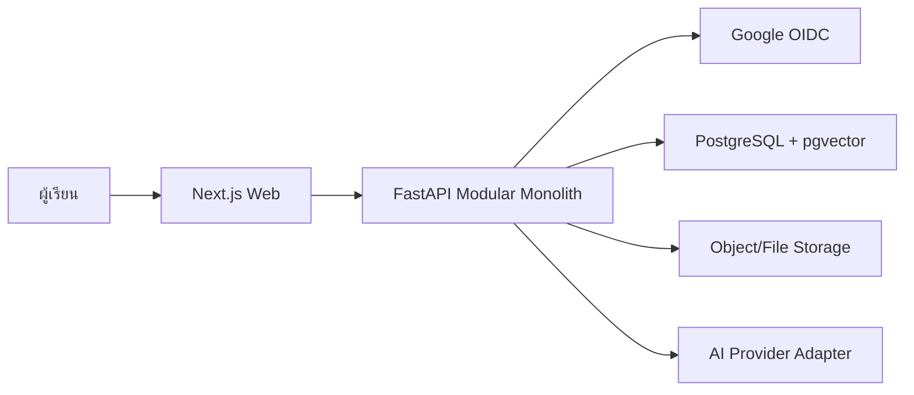

# Learnly AI

เว็บแอปช่วยเรียนรู้แบบปรับให้เหมาะกับผู้เรียน โดยเปลี่ยน AI จาก “เครื่องเฉลย” ให้เป็น “ผู้ช่วยคิด” ผ่านคำถามนำทาง คำใบ้ แบบฝึกหัด และการวัดผลก่อน–หลังเรียน

> สถานะปัจจุบัน: **Architecture Baseline v2** — repository ยังอยู่ในช่วงเตรียม contract และโครงสร้างก่อนเริ่ม implementation

## MVP User Journey

```text
Landing → Continue with Google → Dashboard → Create Learning Session
→ Upload Text/PDF/Image → AI Processing → Pre-test → Guided Learning
→ Transfer Exercise → Post-test → Result / Learning Profile / History
```

## Architecture Summary

Learnly AI ใช้รูปแบบ **Modular Monolith** เพื่อให้ทีม 4 คนพัฒนาและทดสอบแต่ละโมดูลแยกกันได้ โดยไม่เพิ่มความซับซ้อนของ microservices เกินความจำเป็น



### Technology Baseline

| Layer | Technology |
|---|---|
| Frontend | Next.js, React, TypeScript, KaTeX, SVG/Canvas |
| Backend | Python, FastAPI, Pydantic, SQLAlchemy/Alembic |
| Authentication | Google OpenID Connect บน OAuth 2.0 Authorization Code Flow |
| Session | Server-side session + Secure HttpOnly cookie |
| Database | PostgreSQL + pgvector |
| AI | Provider Adapter รองรับการสลับ Kimi, DeepSeek หรือ OpenRouter |
| Deployment | Docker Compose สำหรับ MVP |

Frontend จะไม่เรียก AI provider และไม่ถือ API key โดยตรง ทุกผลลัพธ์จาก AI ต้องผ่าน backend, grounded context และ JSON Schema validation ก่อนส่งให้ UI

## เอกสารสำคัญ

- [สถาปัตยกรรมระบบ](docs/architecture.md)
- [OAuth/OIDC และ Application Session](docs/authentication.md)
- [API Contract](docs/api-contract.md)
- [Data Model](docs/data-model.md)
- [โครงสร้าง Repository](docs/repository-structure.md)
- [กระบวนการพัฒนา](docs/development-workflow.md)
- [Structured Tutor Output Schema](contracts/learning-output.schema.json)

## การแบ่งงานทีมปัจจุบัน

| Owner | ขอบเขตหลัก |
|---|---|
| Cake | UX/UI, Design System และ Frontend |
| Best | Google OIDC, Application Session และ User module |
| Seiya | Learning Session API, Persistence และ History |
| Steve | Architecture, AI Orchestrator, RAG และ Learning Engine |

ทุกงานต้องมี reviewer อย่างน้อย 1 คน เพื่อป้องกัน knowledge silo

## Development Flow

```text
feature/* → Pull Request → develop → Integration Test → main
```

- ห้าม commit secret, OAuth client secret หรือ model API key
- ถ้า API หรือ Schema เปลี่ยน ต้องอัปเดต contract ใน PR เดียวกัน
- เป้าหมายแรกของทีมคือ Vertical Slice ที่ทำงานครบ โดยอนุญาตให้ AI เป็น mock ได้

## First Vertical Slice

1. Login ด้วย Google OIDC
2. สร้าง Learning Session
3. รับ mock text material
4. Mock Learning Engine ส่ง structured response ที่ผ่าน schema
5. Frontend render guided lesson
6. บันทึก session และแสดงใน History

