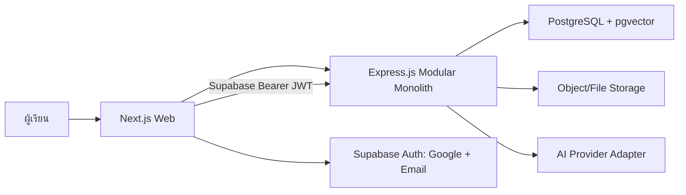

# Learnly AI

เว็บแอปช่วยเรียนรู้แบบปรับให้เหมาะกับผู้เรียน โดยเปลี่ยน AI จาก “เครื่องเฉลย” ให้เป็น “ผู้ช่วยคิด” ผ่านคำถามนำทาง คำใบ้ แบบฝึกหัด และการวัดผลก่อน–หลังเรียน

> สถานะ 2026-10-09: Login (Google/Email) ได้รับอนุมัติว่าเสร็จแล้ว, persistent learning sessions และ history อยู่ในโค้ดจริง; RAG retrieval, assessment, OCR และ full E2E ยังไม่ครบ

## MVP User Journey

```text
Landing → /SignIn (Google หรือ Email/Password) / /SignUp + verify email → /Home
→ /Create → /Chat/[sessionId] → /History
(Planned: PDF/Image, Pre/Post-test, learning mastery)
```

## Architecture Summary

Learnly AI ใช้รูปแบบ **Modular Monolith** เพื่อให้ทีม 4 คนพัฒนาและทดสอบแต่ละโมดูลแยกกันได้ โดยไม่เพิ่มความซับซ้อนของ microservices เกินความจำเป็น


```mermaid
flowchart LR
    U["ผู้เรียน"] --> W["Next.js Web"]
    W --> A["Express.js Modular Monolith"]
    W --> G["Supabase Auth: Google + Email"]
    W -->|"Supabase Bearer JWT"| A
    A --> D["PostgreSQL + pgvector"]
    A --> S["Object/File Storage"]
    A --> M["AI Provider Adapter"]
```

### Technology Baseline

| Layer | Technology |
|---|---|
| Frontend | Next.js, React, TypeScript, KaTeX, SVG/Canvas |
| Backend | Node.js, Express.js, TypeScript, Zod, Prisma |
| Authentication | Supabase Auth: Google OAuth/OIDC และ Email/Password + Email Verification |
| Session | Supabase-managed browser session; Express verifies Bearer JWT |
| Database | PostgreSQL + pgvector |
| AI | Provider Adapter รองรับการสลับ Kimi, DeepSeek หรือ OpenRouter |
| Deployment | Vercel (Web/API), hosted Supabase Auth/PostgreSQL; no Docker |

เลือก Express.js เพราะทีมเรียน framework นี้ในรายวิชาอยู่แล้ว และสามารถใช้ TypeScript ร่วมกันทั้ง Frontend/Backend ช่วยลด learning curve และ friction ระหว่างสมาชิก ส่วน AI/RAG เรียกผ่าน provider API และ adapter ได้โดยไม่เพิ่ม runtime อีกภาษาใน MVP

Frontend จะไม่เรียก AI provider และไม่ถือ API key โดยตรง ทุกผลลัพธ์จาก AI ต้องผ่าน backend, grounded context และ JSON Schema validation ก่อนส่งให้ UI

## Local Environment

Environment template แยกตาม service: ใช้ `apps/web/.env.example` สำหรับ Web และ `services/api/.env.example` สำหรับ API โดยไม่ใช้ `.env` ร่วมที่ root ของ repository

รายละเอียดการตั้งค่าอยู่ใน `apps/web/README.md` และ `services/api/README.md` ห้าม commit `.env`, `.env.local` หรือ secret จริงเข้า repository

## เอกสารสำคัญ

- [สถาปัตยกรรมระบบ](docs/architecture.md)
- [Supabase Auth และ Bearer Token](docs/authentication.md)
- [API Contract](docs/api-contract.md)
- [Tutor Output Contract](docs/tutor-output-contract.md)
- [Data Model](docs/data-model.md)
- [โครงสร้าง Repository](docs/repository-structure.md)
- [กระบวนการพัฒนา](docs/development-workflow.md)
- [Structured Tutor Output Schema](contracts/learning-output.schema.json)

## การแบ่งงานทีมปัจจุบัน

| Owner | ขอบเขตหลัก |
|---|---|
| Cake | UX/UI, Design System และ Frontend |
| Best | Supabase Auth และ User module |
| Zeya | Learning Session API, Persistence และ History |
| Steve | Architecture, AI Orchestrator, RAG และ Learning Engine |

ทุกงานต้องมี reviewer อย่างน้อย 1 คน เพื่อป้องกัน knowledge silo

## Development Flow

```text
feature/* → Pull Request → develop → Integration Test → main
```

- ห้าม commit secret, OAuth client secret หรือ model API key
- ถ้า API หรือ Schema เปลี่ยน ต้องอัปเดต contract ใน PR เดียวกัน
- เป้าหมายแรกของทีมคือ Vertical Slice ที่ทำงานครบ โดยอนุญาตให้ AI เป็น mock ได้

## First Vertical Slice

1. Login ด้วย Google หรือ Email/Password ผ่าน Supabase Auth
2. สร้าง Learning Session
3. รับ mock text material
4. Mock Learning Engine ส่ง structured response ที่ผ่าน schema
5. Frontend render guided lesson
6. บันทึก session ใน PostgreSQL และแสดงใน History
