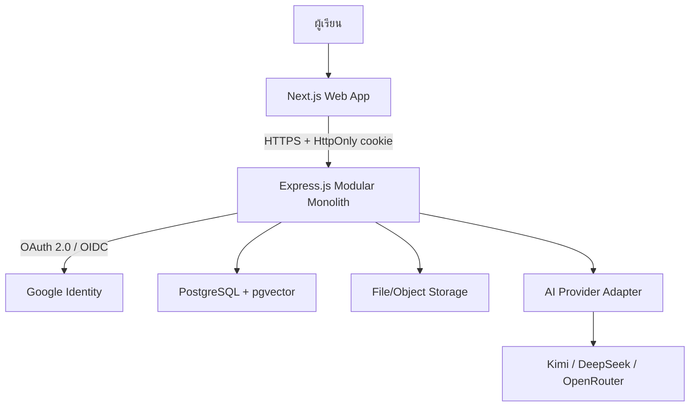
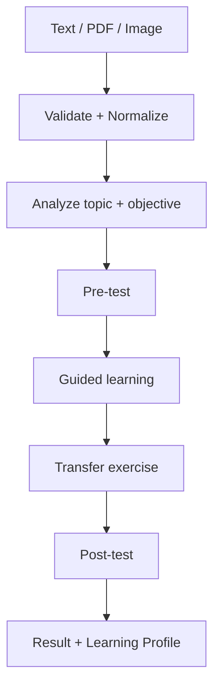
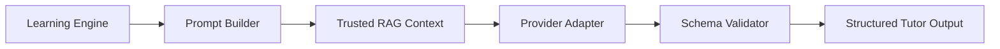
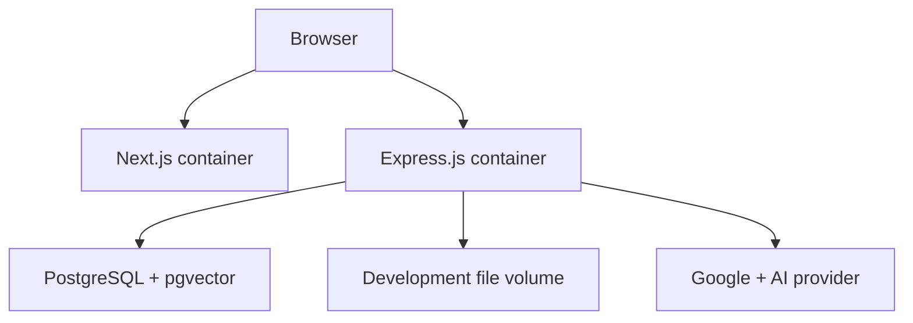

# สถาปัตยกรรมระบบ Learnly AI

เอกสารนี้เป็น Architecture Baseline v2 สำหรับ MVP และเป็น source of truth ร่วมกันของ Frontend, Backend, Data และ AI workstream

## 1. Architecture Style

ระบบใช้ **Modular Monolith**: deploy backend เป็น service เดียว แต่แบ่งโมดูลและ dependency ให้ชัดเจน สามารถทดสอบแต่ละโมดูลแยกได้ เหมาะกับขอบเขตโปรเจกต์มหาวิทยาลัยและทีม 4 คนมากกว่า microservices

หลักการ dependency:

- Frontend รู้จักเฉพาะ HTTP API และ shared contracts
- Route/Controller เรียก Application Service ไม่เข้าถึง database หรือ AI provider โดยตรง
- Learning Engine ควบคุม workflow แบบ deterministic
- AI Orchestrator สร้างเนื้อหาภายในขอบเขตที่ Learning Engine กำหนด
- AI provider ทุกเจ้าถูกซ่อนหลัง Provider Adapter
- Provider response ต้องผ่าน schema validation ก่อนออกจาก backend

## 2. System Context



## 3. Backend Module Boundaries

| Module | หน้าที่ | ห้ามรับผิดชอบ |
|---|---|---|
| `auth` | OIDC callback, app session, current user, logout | ไม่เก็บ password และไม่ให้ frontend verify identity เอง |
| `users` | Profile และ user identity ภายในระบบ | ไม่จัดการ token ของ AI provider |
| `learning_sessions` | สร้าง session, state transition, history | ไม่สร้างคำตอบ LLM โดยตรง |
| `input_processing` | Validate/normalize text, PDF, image/OCR | ไม่ตัดสิน learning stage |
| `assessments` | Pre/post-test, deterministic scoring | ไม่ให้ LLM เป็นผู้คำนวณคะแนนสุดท้าย |
| `learning_profiles` | Mastery, strengths, weak points, progress | ไม่อ่าน raw provider response |
| `ai_orchestrator` | Prompt, retrieval, provider call, validation | ไม่ควบคุม HTTP session/cookie |
| `rag` | Ingestion, chunking, embedding, retrieval, citations | ไม่ตอบ frontend โดยตรง |
| `shared` | Config, errors, logging, DB, observability | ไม่มี business rule เฉพาะ module |

## 4. Learning Pipeline



สถานะที่ backend อนุญาต:

```text
INPUT → CONTENT_ANALYSIS → PRE_TEST → LEARNING → TRANSFER → POST_TEST → COMPLETED
```

การเปลี่ยน state ทุกครั้งต้อง:

1. ตรวจสิทธิ์ว่า session เป็นของ current user
2. ตรวจ transition จาก state ปัจจุบัน
3. บันทึก state และ timestamp ใน transaction
4. คืน state ใหม่ผ่าน contract เดียวกัน

## 5. AI Execution Boundary



Human-centred AI policy สำหรับ MVP:

- เริ่มด้วยคำถามนำทางหรือคำใบ้ ไม่เฉลยทันที
- คำตอบต้องอ้างอิง source metadata เมื่อใช้ RAG
- คะแนน pre/post-test คำนวณด้วย deterministic code
- PII, secret และ raw token ห้ามอยู่ใน prompt/log
- Output ที่ไม่ผ่าน `contracts/learning-output.schema.json` ต้อง retry แบบจำกัดครั้งหรือคืน controlled error

## 6. Authentication Boundary

Login ใช้ Google OpenID Connect บน OAuth 2.0 Authorization Code Flow แล้วสร้าง **application session ฝั่ง server** รายละเอียดอยู่ใน [authentication.md](authentication.md)

Frontend ไม่รับ Google client secret, ไม่สร้าง user จากข้อมูลที่ยังไม่ verify และไม่เก็บ application token ใน `localStorage`

## 7. Data and Storage

- PostgreSQL เป็น system of record
- pgvector ใช้กับ trusted knowledge chunks เท่านั้นใน MVP
- ไฟล์ต้นฉบับเก็บผ่าน Storage interface เพื่อเปลี่ยนจาก local volume เป็น object storage ได้
- Database เก็บ metadata/owner/status ของไฟล์ ไม่เก็บ binary ขนาดใหญ่ในตารางหลัก
- ทุก query ของ user-owned resource ต้อง scope ด้วย `current_user.id`

ดู entity และ constraint ที่ [data-model.md](data-model.md)

## 8. Reliability and Security

- Validate request ด้วย Zod และ validate AI output ด้วย JSON Schema
- จำกัดชนิด/ขนาดไฟล์ และตรวจชื่อไฟล์ที่ไม่ปลอดภัย
- กำหนด connect/read timeout และ retry เฉพาะ transient error
- ใช้ idempotency สำหรับ operation ที่เสี่ยงถูก submit ซ้ำ
- Centralized error envelope; production response ห้าม leak stack trace
- Structured logging พร้อม request ID แต่ไม่ log cookie, authorization code, token หรือ API key
- Health endpoints แยก liveness และ readiness
- OAuth `state`, nonce/PKCE ตาม library support, exact redirect URI และ secure cookie
- มี unit, contract, integration และ end-to-end smoke tests

## 9. Deployment Topology (MVP)



Docker Compose ใช้สำหรับ local development และ demo deployment ส่วน production ต้องเปิด HTTPS และตั้ง cookie `Secure=true`

Backend ใช้ Node.js + Express.js + TypeScript และ Prisma ตามเนื้อหาที่ทีมเรียนในรายวิชา ส่วน AI/RAG อยู่หลัง TypeScript interfaces และ provider adapters หากอนาคตจำเป็นต้องมี runtime อื่นจึงค่อยพิจารณาแยก worker ผ่าน Architecture Decision ใหม่ ซึ่งไม่รวมอยู่ใน MVP นี้

## 10. Out of Scope for MVP

- Microservices, event bus และ Kubernetes
- Email/password authentication และ password reset
- Multi-provider account linking UI
- Fine-tuning model
- Real-time collaborative classroom
- Billing และ subscription
