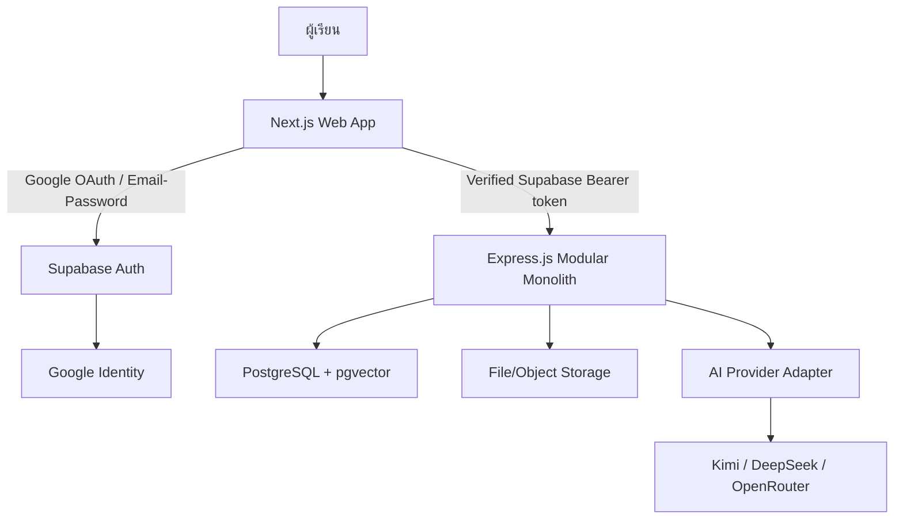
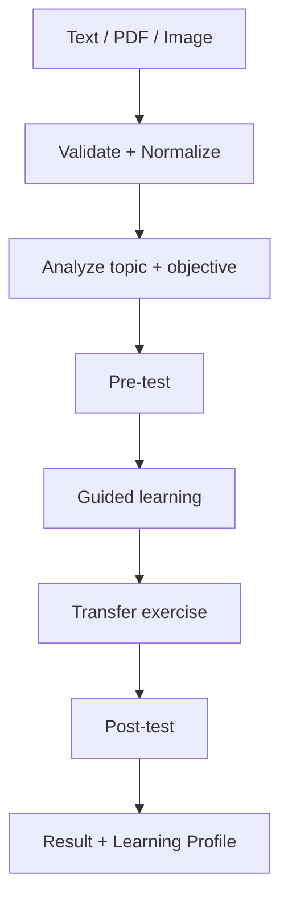
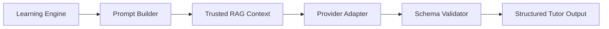
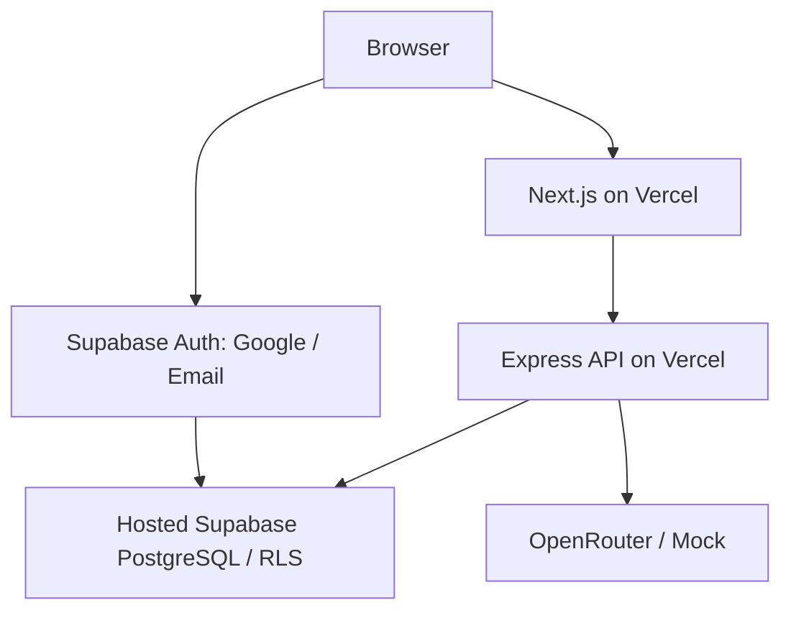

# สถาปัตยกรรมระบบ Learnly AI

เอกสารนี้เป็น Implementation-aligned Architecture (2026-10-09) สำหรับ MVP และเป็น source of truth ร่วมกันของ Frontend, Backend, Data และ AI workstream

## 1. Architecture Style

ระบบใช้ **Modular Monolith**: deploy backend เป็น service เดียว แต่แบ่งโมดูลและ dependency ให้ชัดเจน สามารถทดสอบแต่ละโมดูลแยกได้ เหมาะกับขอบเขตโปรเจกต์มหาวิทยาลัยและทีม 4 คนมากกว่า microservices

หลักการ dependency:

- Frontend รู้จักเฉพาะ HTTP API และ shared contracts
- Route/Controller เรียก Application Service ไม่เข้าถึง database หรือ AI provider โดยตรง
- Learning Engine ควบคุม workflow แบบ deterministic
- AI Orchestrator สร้างเนื้อหาภายในขอบเขตที่ Learning Engine กำหนด
- AI provider ทุกเจ้าถูกซ่อนหลัง Provider Adapter
- Provider response ต้องผ่าน schema validation ก่อนออกจาก backend

## 2. System Context


```mermaid
flowchart TB
    Learner["ผู้เรียน"] --> Web["Next.js Web App"]
    Web -->|"Google OAuth / Email-Password"| Auth["Supabase Auth"]
    Auth --> Google["Google Identity"]
    Web -->|"Verified Supabase Bearer token"| API["Express.js Modular Monolith"]
    API --> DB["PostgreSQL + pgvector"]
    API --> Files["File/Object Storage"]
    API --> Provider["AI Provider Adapter"]
    Provider --> Models["Kimi / DeepSeek / OpenRouter"]
```

## 3. Backend Module Boundaries

| Module | หน้าที่ | ห้ามรับผิดชอบ |
|---|---|---|
| `auth` | Verify Supabase JWT and attach user context for protected API | ไม่เก็บ password และไม่ให้ frontend verify identity เอง |
| `users` | Profile และ user identity ภายในระบบ | ไม่จัดการ token ของ AI provider |
| `learning_sessions` | สร้าง session, state transition, history | ไม่สร้างคำตอบ LLM โดยตรง |
| `input_processing` | Validate/normalize text, PDF, image/OCR | ไม่ตัดสิน learning stage |
| `assessments` | Pre/post-test, deterministic scoring | ไม่ให้ LLM เป็นผู้คำนวณคะแนนสุดท้าย |
| `learning_profiles` | Mastery, strengths, weak points, progress | ไม่อ่าน raw provider response |
| `ai_orchestrator` | Prompt, retrieval, provider call, validation | ไม่ควบคุม HTTP session/cookie |
| `rag` | Ingestion, chunking, embedding, retrieval, citations | ไม่ตอบ frontend โดยตรง |
| `shared` | Config, errors, logging, DB, observability | ไม่มี business rule เฉพาะ module |

## 4. Learning Pipeline


```mermaid
flowchart TD
    I["Text / PDF / Image"] --> N["Validate + Normalize"]
    N --> C["Analyze topic + objective"]
    C --> P["Pre-test"]
    P --> L["Guided learning"]
    L --> T["Transfer exercise"]
    T --> O["Post-test"]
    O --> R["Result + Learning Profile"]
```

สถานะที่ backend อนุญาต:

```text
INPUT → CONTENT_ANALYSIS → PRE_TEST → LEARNING → TRANSFER → POST_TEST → COMPLETED
```

The sequence above is the original workflow/API baseline. The standalone [Learning Engine Core](learning-engine-core.md) now separates session lifecycle (`ACTIVE`, `COMPLETED`, `FAILED`) from teaching stage (`DIAGNOSE` → `EXPLAIN` → `PRACTICE` → `ASSESS` → `REVIEW`). It maps teaching stages to the existing Tutor Output stage enum, starts its MVP slice at `EXPLAIN`, and advances only through explicit engine-controlled actions. The Prisma adapter must reconcile the stored baseline fields with these separate concepts; this sprint does not change the database schema.

การเปลี่ยน state ทุกครั้งต้อง:

1. ตรวจสิทธิ์ว่า session เป็นของ current user
2. ตรวจ transition จาก state ปัจจุบัน
3. บันทึก state และ timestamp ใน transaction
4. คืน state ใหม่ผ่าน contract เดียวกัน

## 5. AI Execution Boundary


```mermaid
flowchart LR
    E["Learning Engine"] --> P["Prompt Builder"]
    P --> R["Trusted RAG Context"]
    R --> A["Provider Adapter"]
    A --> V["Schema Validator"]
    V --> O["Structured Tutor Output"]
```

Human-centred AI policy สำหรับ MVP:

- เริ่มด้วยคำถามนำทางหรือคำใบ้ ไม่เฉลยทันที
- คำตอบต้องอ้างอิง source metadata เมื่อใช้ RAG
- คะแนน pre/post-test คำนวณด้วย deterministic code
- PII, secret และ raw token ห้ามอยู่ใน prompt/log
- Output ที่ไม่ผ่าน `contracts/learning-output.schema.json` ต้อง retry แบบจำกัดครั้งหรือคืน controlled error

## 6. Authentication Boundary

**Approved complete (2026-10-09):** Google OAuth/OIDC and email/password login, registration and verification are managed by Supabase Auth. The browser callback at `/auth/callback` syncs the app profile and routes to `/Home`. Express does not implement its own Google callback or application-cookie session. Protected learning-session endpoints validate Supabase Bearer tokens and use JWT-scoped RLS for database access. See [authentication.md](authentication.md).

## 7. Data and Storage

- PostgreSQL เป็น system of record
- pgvector ใช้กับ trusted knowledge chunks เท่านั้นใน MVP
- ไฟล์ต้นฉบับเก็บผ่าน Storage interface เพื่อเปลี่ยนจาก local volume เป็น object storage ได้
- Database เก็บ metadata/owner/status ของไฟล์ ไม่เก็บ binary ขนาดใหญ่ในตารางหลัก
- ทุก query ของ user-owned resource ต้อง scope ด้วย `current_user.id`

ดู entity และ constraint ที่ [data-model.md](data-model.md)

## 8. Reliability and Security

- Validate request ด้วย Zod และ validate AI output ด้วย JSON Schema
- จำกัดชนิด/ขนาดไฟล์ และตรวจชื่อไฟล์ที่ไม่ปลอดภัย
- กำหนด connect/read timeout และ retry เฉพาะ transient error
- ใช้ idempotency สำหรับ operation ที่เสี่ยงถูก submit ซ้ำ
- Centralized error envelope; production response ห้าม leak stack trace
- Structured logging พร้อม request ID แต่ไม่ log cookie, authorization code, token หรือ API key
- Health endpoints แยก liveness และ readiness
- OAuth `state`, nonce/PKCE ตาม library support, exact redirect URI และ secure cookie
- มี unit, contract, integration และ end-to-end smoke tests

## 9. Deployment Topology (MVP)


```mermaid
flowchart TB
    Browser["Browser"] --> Web["Next.js on Vercel"]
    Browser --> Auth["Supabase Auth: Google / Email"]
    Web --> API["Express API on Vercel"]
    API --> DB["Hosted Supabase PostgreSQL / RLS"]
    API --> Model["OpenRouter / Mock"]
    Auth --> DB
```

No Docker or Docker Compose. Local development uses Node.js 24.x via `npm ci` and `npm run dev` in `apps/web` and `services/api`. Set environment variables in Vercel/Supabase; never commit secrets. `/health/ready` currently reports API process readiness only, not DB readiness.

## 10. Out of Scope for MVP

- Microservices, event bus และ Kubernetes
- Custom Express-owned OAuth sessions (replaced by Supabase Auth)
- Password reset UX (not part of confirmed completed login scope)
- Multi-provider account linking UI
- Fine-tuning model
- Real-time collaborative classroom
- Billing และ subscription
