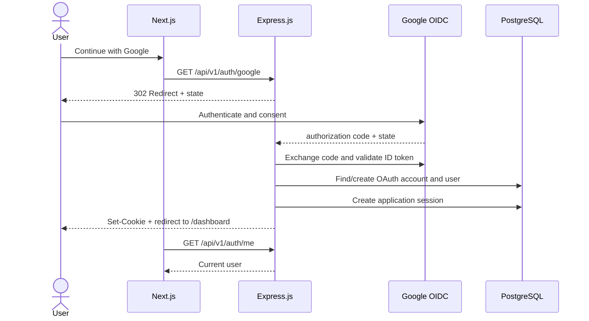

# Authentication: Google OAuth 2.0 + OpenID Connect

## Decision

MVP ใช้ **Google OpenID Connect (OIDC)** บน OAuth 2.0 Authorization Code Flow เพียง provider เดียว และใช้ server-side application session ผ่าน HttpOnly cookie

OAuth 2.0 ทำหน้าที่ authorization ส่วน OIDC เพิ่ม identity layer สำหรับ login

## Login Sequence



## API Endpoints

| Method | Path | Authentication | Behavior |
|---|---|---|---|
| GET | `/api/v1/auth/google` | Public | สร้าง state แล้ว redirect ไป Google |
| GET | `/api/v1/auth/google/callback` | Public | ตรวจ state/code, validate ID token, find/create user, create app session |
| GET | `/api/v1/auth/me` | Cookie | คืน current user หรือ 401 |
| POST | `/api/v1/auth/logout` | Cookie | revoke/delete app session และ clear cookie |

First login คือ registration: เมื่อ `(provider, subject)` ยังไม่มี ระบบจะสร้าง `users` และ `oauth_accounts` ใน transaction เดียวกัน ครั้งถัดไปถือเป็น login

## Identity Mapping

- ใช้ Google claim `sub` เป็น provider identity
- ห้ามใช้ email เป็น primary OAuth identity
- บังคับ unique constraint `(provider, subject)`
- Email/name/avatar เป็น profile claims ที่อัปเดตได้ ไม่ใช่ proof of identity ถาวร

## Application Session

ตัวอย่าง cookie:

```text
learnly_session=<opaque-random-value>
```

ค่าที่แนะนำ:

| Attribute | Development | Production |
|---|---|---|
| `HttpOnly` | true | true |
| `Secure` | false เฉพาะ localhost | true |
| `SameSite` | Lax | Lax |
| `Path` | `/` | `/` |
| Expiry | กำหนดชัดเจน | กำหนดชัดเจนและ rotate ได้ |

Database ควรเก็บ hash/digest ของ session token ไม่เก็บ raw token หากทำได้

## Frontend Rules

- ปุ่มหลักใช้ข้อความ `Continue with Google`
- ไม่จำเป็นต้องแยกหน้า Login และ Register ใน OAuth-only MVP
- Request ที่ต้อง login ต้องส่ง cookie (`credentials: include` เมื่อ frontend/backend ต่าง origin)
- เมื่อได้ 401 ให้ redirect ไป `/login` โดยไม่วนลูป
- ห้ามเก็บ ID token หรือ app session ใน `localStorage`

## Required Environment Variables

```dotenv
GOOGLE_CLIENT_ID=
GOOGLE_CLIENT_SECRET=
GOOGLE_REDIRECT_URI=http://localhost:8000/api/v1/auth/google/callback
SESSION_SECRET=
FRONTEND_URL=http://localhost:3000
```

ไฟล์ `.env` จริงห้าม commit เข้า repository

## Security Acceptance Criteria

- ตรวจ `state` และ exact redirect URI
- ใช้ OIDC library ที่ดูแล code exchange และ token validation ไม่ implement protocol เองทั้งหมด
- ตรวจ issuer, audience, expiry และ signature ของ ID token
- Rotate session หลัง login สำเร็จเพื่อป้องกัน session fixation
- Logout ต้อง invalidate session ฝั่ง server
- Error response ห้ามส่ง authorization code, token หรือ provider error detail ที่อ่อนไหวกลับ client
- Protected endpoint ทุกตัวต้อง derive user จาก application session เท่านั้น
