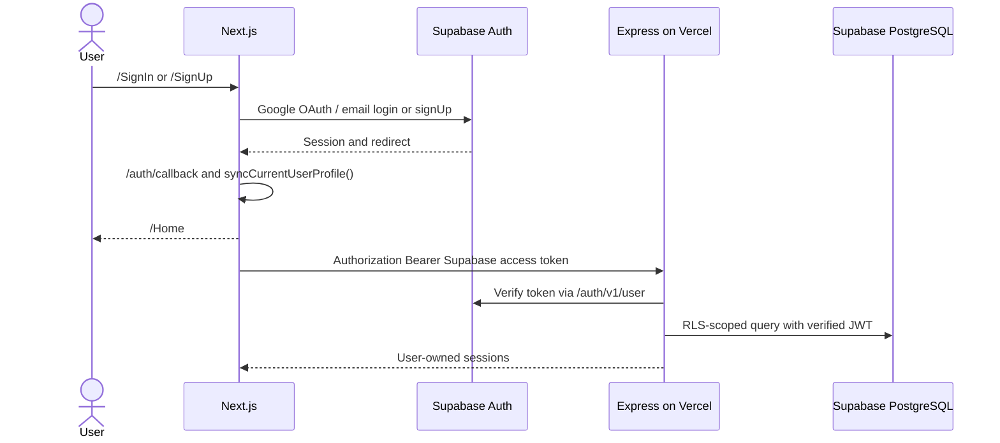

# Authentication — implemented and approved (2026-10-09)

The project owner confirms login is complete and usable. **Supabase Auth** handles Google OAuth 2.0/OIDC and email/password signup/login with email verification. The old Express-managed Google OIDC and custom application-cookie approach is superseded.

## Actual flow

```mermaid
sequenceDiagram
    actor User
    participant Web as Next.js
    participant Auth as Supabase Auth
    participant API as Express on Vercel
    participant DB as Supabase PostgreSQL
    User->>Web: /SignIn or /SignUp
    Web->>Auth: Google OAuth / email login or signUp
    Auth-->>Web: Session and redirect
    Web->>Web: /auth/callback and syncCurrentUserProfile()
    Web-->>User: /Home
    Web->>API: Authorization Bearer Supabase access token
    API->>Auth: Verify token via /auth/v1/user
    API->>DB: RLS-scoped query with verified JWT
    API-->>Web: User-owned sessions
```

Web routes: `/SignIn`, `/SignUp`, `/verify-email`, `/auth/callback`, `/Home`. Supabase browser client uses `signInWithOAuth`, `signInWithPassword`, `signUp`, `getUser/getSession`, and `signOut`. The synced `public.User` profile maps `authUserId` to the Supabase user ID.

There are **no Express auth/google, auth/google/callback, auth/me or auth/logout endpoints** in the current backend. Protected learning-session API requests must send a Supabase access token, validated by `requireSupabaseUser`. Database ownership and RLS checks use verified identity.

## Environment and security

Browser: `NEXT_PUBLIC_SUPABASE_URL`, `NEXT_PUBLIC_SUPABASE_PUBLISHABLE_KEY`, `NEXT_PUBLIC_API_BASE_URL`. API: `SUPABASE_URL`, `SUPABASE_PUBLISHABLE_KEY`, `DATABASE_URL`. Configure Google provider and redirect allow-list in Supabase Auth and Google Cloud. Do not set a custom Express `GOOGLE_CLIENT_SECRET`, `GOOGLE_REDIRECT_URI` or `SESSION_SECRET` for the current implementation.

Never expose service-role/database secrets in browser code. Never log auth codes, tokens or passwords. Full cross-user isolation and production E2E belong to #14; login approval does not imply that those checks have passed.
