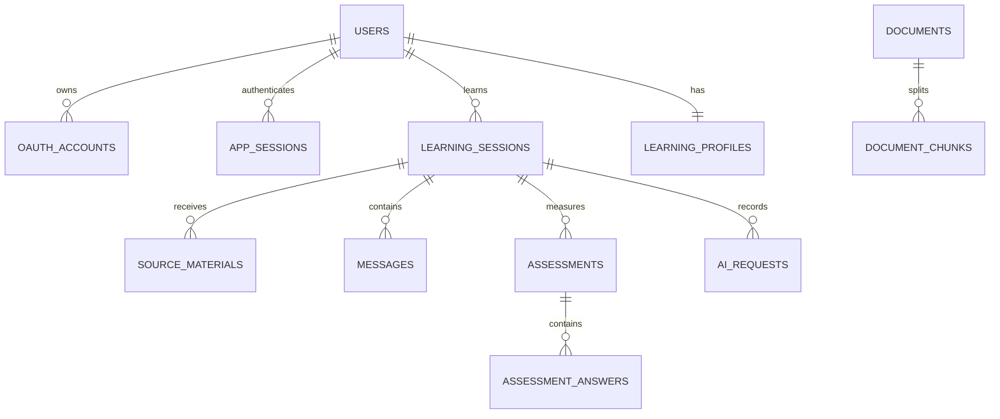

# Data Model (MVP Baseline)

## Entity Relationship

## Core Tables

### `users`

- `id` UUID PK
- `email` text nullable/indexed
- `display_name` text
- `avatar_url` text nullable
- `created_at`, `updated_at`

### `oauth_accounts`

- `id` UUID PK
- `user_id` UUID FK → users
- `provider` text เช่น `google`
- `subject` text จาก OIDC `sub`
- `email_at_provider` text nullable
- `created_at`, `last_login_at`
- `UNIQUE(provider, subject)`

OAuth token ไม่ควรเก็บหากระบบไม่ต้องเรียก Google API หลัง login หากจำเป็นในอนาคตต้อง encrypt และกำหนด retention แยก

### `app_sessions`

- `id` UUID PK
- `user_id` UUID FK → users
- `token_digest` text UNIQUE
- `expires_at`, `created_at`, `last_seen_at`, `revoked_at`

### `learning_sessions`

- `id` UUID PK
- `user_id` UUID FK → users
- `title`, `learning_goal`
- `state` enum/check constraint
- `progress_percent`
- `version` integer สำหรับ optimistic concurrency
- `created_at`, `updated_at`, `completed_at`
- Index `(user_id, created_at DESC)`

### `source_materials`

- `id` UUID PK
- `learning_session_id` UUID FK
- `type` (`TEXT`, `PDF`, `IMAGE`)
- `status` (`UPLOADED`, `PROCESSING`, `READY`, `FAILED`)
- `storage_key` nullable
- `normalized_text` nullable
- `content_hash`, `mime_type`, `size_bytes`
- `metadata` jsonb

### `messages`

- `id` UUID PK
- `learning_session_id` UUID FK
- `role` (`USER`, `TUTOR`, `SYSTEM`)
- `content` jsonb ตาม contract
- `created_at`

### `assessments` / `assessment_answers`

- Assessment: session, phase (`PRE`, `POST`, `TRANSFER`), score, max_score, submitted_at
- Answer: assessment, question_id, response, is_correct, awarded_score
- Unique assessment ต่อ `(learning_session_id, phase)` ตามกติกา MVP

### `learning_profiles`

- `user_id` UUID PK/FK
- `mastery` jsonb
- `strengths` jsonb
- `weak_points` jsonb
- `updated_at`

### `documents` / `document_chunks`

- Document เก็บ title, source URI, trust level, checksum และ metadata
- Chunk เก็บ document/page/sequence, content, embedding `vector(n)` และ metadata
- Vector dimension ต้องกำหนดจาก embedding model ผ่าน migration ไม่ hard-code หลายค่าปะปน
- เพิ่ม vector index หลังมีข้อมูลและทดสอบ query plan

### `ai_requests`

- `id`, `learning_session_id`, `request_id`
- provider/model, operation, status, latency, token usage, error code
- prompt/output อาจเก็บเฉพาะ redacted snapshot ตาม retention policy
- ห้ามเก็บ API key, cookie, OAuth code หรือ raw token

## Ownership Rule

ทุก repository/query ที่อ่าน resource ของผู้ใช้ต้องรับ `current_user_id` และ scope query ด้วย owner เสมอ การตรวจว่ามี ID อยู่ก่อนแล้วค่อยเช็ก owner ภายหลังอาจทำให้ข้อมูลรั่วผ่าน 404/403 behavior

## Migration Rule

- ใช้ Alembic migration ทุกครั้งที่ schema เปลี่ยน
- Migration ต้อง rollback ได้เมื่อสมเหตุสมผล
- Test database ต้องสร้างจาก migration เดียวกับ production ไม่ใช้ schema ที่เขียนแยก

