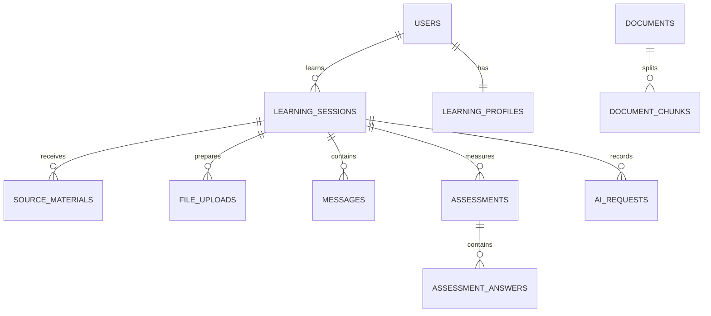

# Data Model — current contract + planned scope (2026-10-10)

> Source of truth: [`services/api/src/prisma/contract.prisma`](../services/api/src/prisma/contract.prisma). Supabase Auth owns identity and login sessions; old application OAuthAccount/AppSession tables are not part of current contract.

## Entity Relationship

```mermaid
erDiagram
    USERS ||--o{ LEARNING_SESSIONS : learns
    LEARNING_SESSIONS ||--o{ SOURCE_MATERIALS : receives
    LEARNING_SESSIONS ||--o{ FILE_UPLOADS : prepares
    LEARNING_SESSIONS ||--o{ MESSAGES : contains
    LEARNING_SESSIONS ||--o{ ASSESSMENTS : measures
    ASSESSMENTS ||--o{ ASSESSMENT_ANSWERS : contains
    USERS ||--|| LEARNING_PROFILES : has
    DOCUMENTS ||--o{ DOCUMENT_CHUNKS : splits
    LEARNING_SESSIONS ||--o{ AI_REQUESTS : records
```

## Core Tables

ชื่อ snake_case ด้านล่างใช้เป็นคำอธิบายเชิงแนวคิด ตารางจริงใน canonical contract ใช้ชื่ออย่าง `User`, `LearningSession`, `SourceMaterial` และ camelCase fields ตรวจชื่อ/type ที่แน่นอนจาก source/generated contract ก่อนเขียน SQL IDs ของแอปเป็น Prisma String/PostgreSQL text; ค่าใหม่ส่วนใหญ่เป็น UUID string ส่วนบัญชีเก่าอาจใช้ ID คนละค่ากับ Auth UID JSON fields emitเป็น PostgreSQL json และ queryอาจcastเป็นjsonb

### `users`

- `id` text PK
- `email` text nullable/indexed
- `display_name` text
- `avatar_url` text nullable
- `created_at`, `updated_at`

### Supabase authentication mapping

- `User.authUserId` is unique and maps to Supabase Auth user UUID. New profiles use Auth UID as `User.id`; existing legacy application IDs are preserved and resolved through `authUserId`.
- Google provider identity, email/password credentials, email verification and session management belong to Supabase Auth.
- User-owned operations are scoped to verified JWT identity and database RLS (`auth.uid()`).
- `oauth_accounts` and `app_sessions` were old plans, not actual current tables.

### `learning_sessions`

- `id` text PK
- `user_id` text FK → users
- `title`, `learning_goal`
- `state` enum/check constraint
- `lifecycleState` (`ACTIVE`, `COMPLETED`, `FAILED`) and engine-owned `stage`
- `progress_percent`
- `version` integer สำหรับ optimistic concurrency
- `created_at`, `updated_at`, `completed_at`
- Index `(user_id, created_at DESC)`

### `source_materials`

- `id` text PK
- `learning_session_id` text FK
- `type` (`TEXT`, `PDF`, `IMAGE`)
- `status` (`UPLOADED`, `PROCESSING`, `READY`, `FAILED`)
- `storage_key` nullable
- `storageBucket` nullable; persisted with key for new binary material
- `normalized_text` nullable
- `content_hash`, `mime_type`, `size_bytes`
- `metadata` JSON; origin/review flags, normalization hash and real extraction page metadata
- Binary learner review stores `learningText`/`learningTextHash`/`reviewedByLearner` only in metadata. Original extracted normalizedText/binary hash/extraction and trusted `reviewed=false` remain unchanged. Unconfirmed binary content is not sent to the tutor. Column-specific UPDATE(metadata) plus initial-session owner/API-context RLS protects edits.

### `FileUpload` — durable binary upload intent

- `id`: material UUID string/text PK; `learningSessionId`: owned session FK
- `state`: `PENDING` / `FINALIZED` / `CANCELLED` with database check constraint
- `material`: internal prepared file/normalized-text/extraction/hash/bucket/key JSON; `createdAt`
- Reserve before Storage mutation; save accepts exact PENDING only. Cancellation and finalization serialize on owned parent session lock; READY SourceMaterial wins over cancellation.
- Owned SELECT, trusted API-context INSERT/UPDATE, no anonymous policy. Journal does not enter the Learning Engine.
- Prepared migrations `20261010T1119_durable_file_uploads` + `20261010T1154_journal_storage_gate`, canonical076ce83. FINALIZED commits with READY; restrictive Storage INSERT needs exact owned active PENDING and excludes existing material. Empty rollback fixtures passed; no production apply. Endpoints/UI/live Storage/OCR remain pending.

### `messages`

- `id` text PK
- `learning_session_id` text FK
- `role` (`USER`, `TUTOR`, `SYSTEM`)
- `content` JSON ตาม contract
- `created_at`

### `assessments` / `assessment_answers`

- Assessment: session, phase (`PRE`, `POST`, `TRANSFER`), topic, immutable snapshot, submissionHash, score, max_score, submitted_at
- Answer: assessment, question_id, response, is_correct, awarded_score
- Unique assessment ต่อ `(learning_session_id, phase)` ตามกติกา MVP

### `learning_profiles`

- `user_id` text PK/FK
- `mastery` JSON
- `strengths` JSON
- `weak_points` JSON
- `updated_at`

### `documents` / `document_chunks`

ส่วนนี้ยังเป็น planned canonical persistence; runtimeปัจจุบันใช้ reviewed curated files และ vector SQL/TEMP verification ไม่ใช่ตารางเหล่านี้ที่สร้างแล้วใน production

- Document เก็บ title, source URI, trust level, checksum และ metadata
- Chunk เก็บ document/page/sequence, content, embedding `vector(n)` และ metadata
- Vector dimension ต้องกำหนดจาก embedding model ผ่าน migration ไม่ hard-code หลายค่าปะปน
- เพิ่ม vector index หลังมีข้อมูลและทดสอบ query plan

### `ai_requests`

- `id`, `learning_session_id`, `request_id`
- provider/model, operation, status, latency, token usage, error code
- prompt/output อาจเก็บเฉพาะ redacted snapshot ตาม retention policy
- ห้ามเก็บ API key, cookie, OAuth code หรือ raw token

## Ownership Rule

ทุก repository/query ที่อ่าน resource ของผู้ใช้ต้องรับ `current_user_id` และ scope query ด้วย owner เสมอ การตรวจว่ามี ID อยู่ก่อนแล้วค่อยเช็ก owner ภายหลังอาจทำให้ข้อมูลรั่วผ่าน 404/403 behavior

## Implementation notes

Canonical `KnowledgeChunk` เก็บ document/version/passage/content/input/provenance hashes, chunk ordinal, original content, source title/URL/license JSON, nullable page และ pgvector 1536 dimensions มี reviewed-only authenticated SELECT RLS และไม่มี learner/anonymous write grants Publication มาจาก curated reader ผ่าน atomic transaction เท่านั้น ข้อมูลนักเรียนอยู่ SourceMaterial แยกกัน Runtime vector mode ต้องเปิดชัดเจน ผลใหม่อยู่ [vector evidence](evidence/mvp-vector-publication-verification.json) Production migration/index ยังไม่ apply

Assessment/Profile/History และ text material flows มี implementations/tests แล้ว แต่ยังขาด public migration และ real Auth/browser journey Binary ingestion/journal/recovery มีโค้ดและ rollback SQL evidence แต่ real PDF/OCR/Storage/endpoints/UI ยังไม่ครบ Canonical vector persistence/runtime และ broader reviewed corpusยังpending ดูรายละเอียดตาม [MVP tracker](mvp-completion-tracker.md) ใช้ Prisma contract/migration workflow ที่ตรวจจริง ไม่ใช้ assumed schema.prisma

## Migration Rule

### Canonical ownership update (MVP completion branch)

`20261009T1032_session_ownership_contract` adds the LearningSession INSERT/UPDATE and Message INSERT ownership policies missing from the canonical contract, plus their authenticated-role grants. Historical manual SQL is retained under `services/api/scripts/historical-sql/`, outside Prisma's migration-space layout. The CLI seeds the Supabase extension snapshot/head supplied by its installed descriptor; it ships no Auth schema migration operations.

Plan from the explicit latest graph tip (`--from <hash>`), because the checked-in `db` ref historically points to an older baseline. Do not assume that ref proves production history. This change passed unscoped artifact/graph checks and real isolated-schema ownership tests with rollback. Applying it to public production tables and replaying the full historical data-migration chain remain separate release checks; never replay destructive legacy user cleanup automatically.

- ใช้ Prisma 8 contract + repository migrations โดยตรวจ database migration state ก่อน deploy
- Migration ต้อง rollback ได้เมื่อสมเหตุสมผล
- Test database ต้องสร้างจาก migration เดียวกับ production ไม่ใช้ schema ที่เขียนแยก
